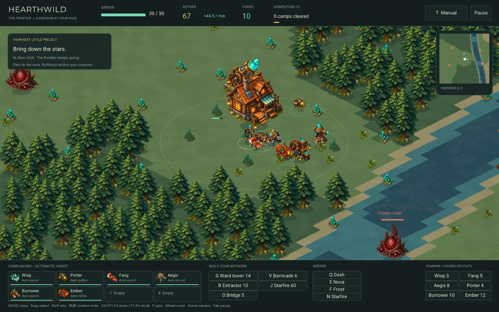

# Hearthwild / ARPG — Frontier

A companion-led homestead and summoner game. Pets handle recurring work; buildings
anchor your outposts. The v3 frontier is a playable systems slice, not an
AAA-complete campaign.



## Play and save

From the repository root:

```sh
./build.sh arpg --fast
./arpg play
./arpg play --no-save
./arpg play --new
./arpg play --save saves/arpg/another-world.bin
./arpg play checkpoints/arpg/RUN/CHECKPOINT.bin
./arpg watch checkpoints/arpg/RUN/CHECKPOINT.bin --deterministic
```

Manual play streams the frontier and resumes `saves/arpg/frontier-v3.bin` when
present. It saves every 60 simulation seconds, on F5, and on normal exit.
`--new` archives the previous save before starting over. `--no-save` starts a
temporary world without reading or writing your save. Custom save paths need an
existing parent directory. R requires a second press within four seconds; a saved
campaign is archived before replacement. Invalid/incompatible saves are rejected
without overwriting them. Saves are versioned, checksummed, and replaced atomically.

Pausing stops all production. Distant outposts continue producing while the game
is running; there is **no catch-up for time spent with the application closed**.
In campaign play, death returns the keeper to the lodge for up to 5 aether, without
erasing the world. `--arena` and `watch` use the bounded training map and do not
touch the campaign save.

A compatible checkpoint is optional. Without one, companions use explicitly
labelled automatic/scripted assistance. With one, its eight task heads can direct
the pets while you control the keeper. `watch` requires a real compatible model.
No trained v3 policy is bundled; older checkpoints require retraining.

## Controls

| Input | Effect |
| --- | --- |
| WASD / arrows, or left-click ground | Move the keeper; click movement uses terrain navigation |
| Click a pet/card | Select that companion |
| Drag a box / Shift-click | Select several / add or remove a companion |
| Right-click a seam | Assign selected companions to that specific renewable deposit |
| Right-click a camp or enemy | Attack that target; camp orders prioritize its core |
| Right-click ground | Move selected pets, then hold the destination |
| Ctrl-right-click ground | Attack-move |
| Right-click rock/forest | Burrower/Ember work a corridor toward that point |
| Task buttons | Assist, Gather, Escort, Hunt, Hold, Home, or ongoing Terrain work |
| P | Clear selected pets' overrides; with no selection, restore all automatic assistance |
| Ctrl+F1–F4 / F1–F4 | Store / recall a selection group |
| Delete | Release selected summons; refund half their aether cost |
| 1 / 2 / 3 / 4 | Follow / Advance / Hold / Focus for automatically controlled combat pets |
| G / V / B | Place ward tower / barricade / extractor |
| J / O | Place Starfire launcher / bridge |
| Shift-click while placing | Keep the construction tool selected for another placement |
| Backspace | Cancel placement/targeting and clear selection |
| Summon buttons | Summon a class; hovering works even on locked or unaffordable buttons |
| Z/X/C/M, then Space | Select Wisp/Fang/Aegis/Porter and summon; Space also repeats the last clicked summon class |
| Q / E / F | Dash / Nova / Frost |
| N, then left-click | Fire a ready Starfire launcher at the chosen position |
| Wheel / middle-drag / Home | Zoom / pan / resume camera follow |
| Tab / T / H | Pause / toggle model keeper control / debug hitboxes |
| F5 / R twice | Save / archive and start a new homestead |

A right-click with nothing selected chooses an available porter for a seam, a
terrain specialist for digging, or unassigned fighters for movement/combat.
It does not pull individually assigned workers off their jobs. Selected pets'
command lines show numbered destinations. Individual commands take precedence
over the optional model and older general tasks; P releases that override.

Manual Move/Hold orders remain where issued. Assigned workers can be sent to
different deposits and continue working when you leave. Automatic gathering
prefers unoccupied seams not already covered by extractors. Automatic Ember
companions prefer refining over following the keeper into every battle.

## The loop and current balance

Start with 24 aether, a Wisp and a Porter. Six starter seams sit around a healing
sanctuary; additional seams and camps are generated as you explore. Every 20
harvested aether and every cleared camp adds one technology level. The HUD numbers
homesteads from 1.

| Companion | Role | Aether | Unlock |
| --- | --- | ---: | --- |
| Wisp | General escort, nearby combat and camp attacks | 3 | Homestead 1 |
| Fang | Fast, fragile striker | 5 | Homestead 2 |
| Aegis | Durable front-line guardian | 8 | Homestead 3 |
| Porter | Autonomous gatherer; no combat damage | 4 | Homestead 1 |
| Burrower | Durable fighter and sustained rock/forest excavation | 10 | Homestead 3 |
| Ember | Mobile refinery, melting and combat | 12 | Homestead 4 |

There are eight companion slots. Hover a summon button or card for health, damage,
attack cadence, speed, price, unlock and current order. Class stats and structure
costs are in `config/arpg.ini`.

A seam stores up to 8 aether, renews at 0.1/second and has a shared four-second
extraction cooldown. Its sustainable output is 6 aether/minute: piling multiple
workers onto it does not duplicate its stock. Spread workers and extractors out.
The keeper also gathers nearby seams automatically.

| Structure | Aether | Purpose |
| --- | ---: | --- |
| Ward tower | 14 | Periodic area damage, including camp cores |
| Barricade | 6 | Block an approach; enemies can chew through it |
| Extractor | 10 | Repeatedly extract nearby seams without a pet |
| Starfire | 60 | Long-range siege; unlocks at Homestead 5 |
| Bridge | 5 | Connected walkable segments across deep water |

An Ember near an extractor consumes **2 aether for 1 core every 8 seconds**.
A Starfire shot costs **8 cores + 20 aether**, has a **30-second reload** and
**48-unit range**, and damages an **8-unit-radius** area. It deals 250 damage to
enemies and 500 to camps, and clears rock, forest and vegetation in a 7-unit
radius. Friendly summons and structures are protected from its damage.
In the campaign, move closer if the whole strike area is not in the live region;
such shots are refused without spending ammunition, with a red targeting preview.
It is an initial fantasy-superweapon loop, not a full arsenal or crafting tree.

Burrowers and Ember can receive one corridor-clearing order, or a Terrain task to
keep clearing nearby material. Excavation changes collision, navigation and saved
terrain. Opened shoreline may become shallow water; bridges provide deliberate
crossings. These are tile-based changes, not underground caves or simulated fluid
volumes.

Camps wake only near the keeper, active pets, or frontier structures. Each has a
budget of three defenders; there are no timed horde waves. Starter camps must
have a walkable route from the sanctuary. New regions can need bridges or
excavation. Default camp health is 40; the regression suite clears a camp with
ordinary Wisp/Fang commands and simulation ticks, without directly invoking damage.

## World generation and persistence

`ar_terrain_tile(seed, world_x, world_y)` is coordinate-addressable: broad
landforms, domain warping, moisture, continuous rivers, shallows and procedural
fords come before decorative details. There is no generated rock border or
cross-shaped road stamped across every region. Decoration also uses world keys,
so rebasing does not reshuffle trees.

The architectural reference is Sean Murray's
[Building Worlds Using Math(s), GDC 2017](https://www.gdcvault.com/play/1024514/Building-Worlds-Using).
This implementation is a small original generator inspired by the idea of
mathematically authored, explorable terrain—not a port of No Man's Sky or a claim
to reproduce the talk's implementation.

The CPU campaign keeps 16×16 persistent chunks around a 64×64 live simulation
window. Crossing the inner 16-cell threshold rebases local physics/camera
coordinates while preserving world positions. Visited terrain, deposits,
buildings, cleared camps, surviving enemies and companion assignments persist.
More terrain is rendered beyond the live window, avoiding an artificial visual
edge; encounters there become active as the live window advances.

There are 32 active building slots, 32 deposit slots and 16 camp slots per window.
Distant structures are stored separately, so the campaign does not have a
32-building global limit. The frontier has no designed outer wall, but practical
integer/precision, memory and save-size limits still exist; visited data grows
with exploration.

Remote production and dispatched-unit movement advance at one-second resolution.
A manually stationed worker is not teleported along with the keeper. Unassigned
escorts may phase back to their summoner when rebasing would strand them.
**Offscreen combat and excavation are suspended** until those regions are live.
A full multi-region simulation, scalable world index and queued RTS orders remain
future work.

## RL contract — observation version 3

This replaces v1/v2. The recurrent policy receives **443 floats** and emits
**13 discrete heads**, with sizes:

```text
[9, 7, 4, 5, 6, 7, 7, 7, 7, 7, 7, 7, 7]
```

| Head | Choices |
| --- | --- |
| 0 | Idle + eight screen-relative movement directions |
| 1 | None + the six companion classes |
| 2 | Follow / Advance / Hold / Focus |
| 3 | None / Dash / Nova / Frost / Starfire at the nearest camp |
| 4 | None + the five building types |
| 5–12 | One pet task each: Assist / Gather / Escort / Hunt / Hold / Home / Terrain |

In manual mode, human input replaces the keeper's five heads; the model can still
choose pet tasks. Explicit per-pet point orders take priority, and the observation
includes those orders and destinations. Automatic Terrain work does not create
a permanent manual override, so the policy can change its task on the next step.

| Observation offsets | Contents |
| --- | --- |
| 0–15 | Keeper, cooldowns, currency, counts, nearest camp |
| 16–79 | Eight pet slots, eight features each |
| 80–119 | Eight nearest enemies, five features each |
| 120–129 | Home, production, technology, rally, shelter, cores, blast indicator |
| 130–225 | 32 deposits: relative position and stock |
| 226–385 | 32 buildings: active, relative position, kind, health |
| 386–393 | Previous pet tasks |
| 394–418 | Keeper-centered 5×5 terrain patch; includes bridges |
| 419–442 | Each pet's command and relative destination |

The GPU trainer uses bounded five-minute segments, not the CPU campaign's
persistent chunk store. Shared gameplay includes production, combat, terrain
edits, refining, Starfire, pathfinding, rewards and observations. CPU box3d and
CUDA analytic separation are still different movement backends, so trajectories
are **not bit-exact**. This remains a transfer gap to measure with trained policies.

```sh
./build.sh arpg --gpu
./puffer train arpg
```

On the local GTX 1060, use `NVCC_ARCH=sm_61 ./build.sh arpg --gpu --float`.
The GPU runner is headless; use the separate `./arpg watch PATH.bin` viewer.
Checkpoint shape is validated before inference. Hidden size and layer count must
match the policy configuration.

## Verification

```sh
make -C ocean/arpg test
make -C ocean/arpg frontier-test
make -C ocean/arpg sanitize
make -C ocean/arpg cuda-test
make -C ocean/arpg native-cpu-test
make -C ocean/arpg viewer-test
```

Tests cover quiet starts on 12 seeds, long mixed-action runs, rewards/resets,
odd-sized CUDA pools, independent model tasks, camera projection/inversion,
screen-space context orders, actual camp combat, long-wall navigation, sustained
tunneling, bridges, refinery and artillery costs, exploration/return persistence,
remote production and dispatch/recall, save round-trips, and corruption rejection.
Sanitizers cover both the shared simulation and frontier persistence.

`ARPG_SEED=42 ARPG_SHOT=/absolute/path.png ARPG_SHOT_FRAME=360 ./arpg play`
captures the real viewer and disables campaign save I/O. The optional
`viewer-test SHOT=/absolute/path.png` builds a homestead through normal production.

The [original and expansion atlases, provenance and final prompts](assets/README.md)
are project-local. Terrain, water, placement previews and effects are rendered
procedurally.

## What remains

This iteration does not provide an AAA content/progression curve, a trained new
policy, true fluid dynamics, underground layers, a large logistics/crafting tree,
queued command chains, fog-of-war scouting, a broad siege arsenal, or offline
catch-up. Current balance is a testable starting point, not a completed tuning
pass. See [the next iteration roadmap](ROADMAP.md).
