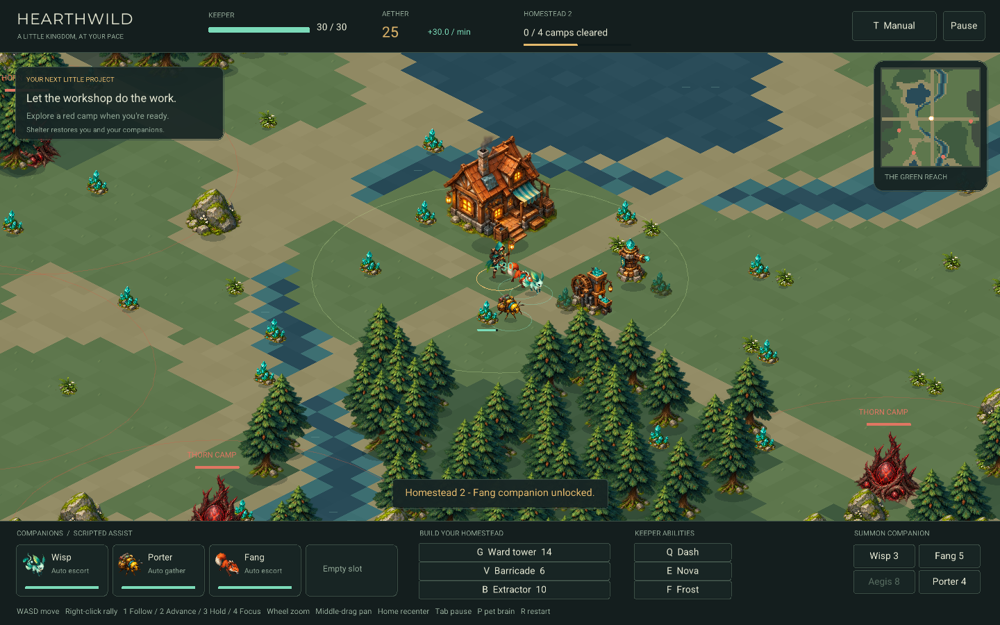

# Hearthwild / ARPG

A small, companion-led homestead game: establish renewable production, grow a
four-pet squad, then explore hostile camps when you choose. There are no timed
horde waves or player-centered spawns.



## Play

Run from the repository root:

```sh
./build.sh arpg --fast
./arpg play
./arpg play checkpoints/arpg/RUN/CHECKPOINT.bin
./arpg watch checkpoints/arpg/RUN/CHECKPOINT.bin --deterministic
```

The viewer starts in manual mode. If a compatible checkpoint exists under
`checkpoints/arpg`, it loads the newest one for the companions. An explicit
checkpoint path must load successfully. Without a checkpoint, the HUD says
**scripted assist**; `watch` refuses to pretend that a scripted bot is an RL model.

## The loop

You start with 24 aether, a wisp escort, and a porter already gathering.
Six renewable crystal deposits surround a sheltered clearing. Extractors collect
from nearby deposits without further commands; no belts, power grid, or hauling
inventory is required. Every 20 harvested aether advances homestead technology.
Fang unlocks after one level and Aegis after two. Each cleared camp adds a level.

The lodge's clearing heals the keeper and companions. Distant camps only wake
when you, a pet, or a frontier structure enters their marked radius, with at most
three defenders per camp. Enemies defend their territory and disengage when you leave. Camp combat
is optional; extractors keep working while you explore.

Construction has a shared eight-building limit. Place extractors beside crystal
seams, ward towers at an outpost, and barricades on approaches. Placement previews
show the footprint, affordability, and extractor coverage; overlapping buildings
and solid terrain are rejected.

## Controls

| Control | Effect |
| --- | --- |
| WASD / arrows, or left-click ground | Move the keeper |
| Right-click ground | Set companion rally point |
| 1 / 2 / 3 / 4 | Follow (clear rally) / Advance / Hold / Focus |
| Click companion card, then a task | Override that companion's job |
| P | Clear task overrides; restore model tasks or scripted assist |
| G / V / B, then left-click | Place ward tower / barricade / extractor |
| Backspace | Cancel construction |
| Summon buttons, or Z/X/C/M then Space | Wisp / Fang / Aegis / Porter |
| Q / E / F | Dash / Nova / Frost |
| Mouse wheel | Zoom the world; UI remains full resolution |
| Middle-mouse drag / Home | Pan the camera / resume following the keeper |
| T | Toggle model-controlled keeper; requires a loaded checkpoint |
| Tab / R / H | Pause / restart / debug hitboxes |

Most keyboard bindings live in `config/arpg.ini [keys]`. The interactive viewer
has no time limit. Death pauses manual play; restart with R. Autoplay restarts
automatically. Pausing also pauses production.

## RL contract — observation version 2

This intentionally replaces the old 88-float, five-head contract. **Retrain old
policies.** The viewer checks checkpoint size before constructing its network;
policy hidden size and layer count must match `config/arpg.ini [policy]`.

One recurrent policy receives 237 floats and produces nine discrete action heads:

| Head | Choices |
| --- | --- |
| 0 | Movement: idle + eight screen-relative directions |
| 1 | Summon: none / wisp / fang / aegis / porter |
| 2 | Squad order: follow / advance / hold / focus |
| 3 | Ability: none / dash / nova / frost |
| 4 | Build: none / ward / barricade / extractor |
| 5–8 | One task per pet slot: assist / gather / escort / hunt / hold / home |

In manual play, the keeper's five heads are overridden by human input while the
four model pet heads still run. In autoplay, the model drives all nine.
Pet tasks are high-level decisions; local movement, harvesting, and attacks
remain shared simulator mechanics, not separately trained low-level pet policies.
Assist defaults to gathering for porters and escorting for combat pets.
Manual task overrides are applied after inference. Recurrent state resets at
episode boundaries and when switching keeper control modes.

| Observation offsets | Contents |
| --- | --- |
| 0–15 | Keeper, cooldowns, currency, counts, nearest camp |
| 16–47 | Four pet slots, eight features each |
| 48–87 | Eight nearest enemies, five features each |
| 88–95 | Home offset, harvested amount, tech, rally, shelter indicator |
| 96–167 | All 24 resource slots: relative position and remaining stock |
| 168–207 | All eight building slots: active, position, kind, health |
| 208–211 | Previous pet tasks |
| 212–236 | Keeper-centered 5×5 terrain patch |

Training episodes last five minutes. CPU and CUDA adapters auto-reset while
retaining the terminal reward/flag. Production and building rewards accompany
combat rewards; damage rewards use actual damage, not overkill.
Logs include harvested aether, buildings, camps cleared, level, and an economy
reward component. Score is harvested aether + 20 × camps cleared. Performance
equally weights harvesting 100 aether and the fraction of camps cleared.

```sh
./build.sh arpg --gpu
./puffer train arpg
```

For the local GTX 1060, build with `NVCC_ARCH=sm_61 ./build.sh arpg --gpu --float`.
The GPU training/evaluation binary is headless; use `./arpg watch PATH.bin` for
rendered autoplay. No trained v2 policy is bundled.

## Physics backends

Both backends use `ar_sim.h` for gameplay and a fixed 60 Hz tick.
The CPU viewer uses box3d; CUDA uses analytic movement/separation with SoA
storage. Shared rules do not imply bit-exact trajectories. Companions use local
terrain/body avoidance, not a global RTS pathfinder. Keep this transfer gap in
mind when evaluating a GPU-trained policy in the CPU viewer.

## Verification

```sh
make -C ocean/arpg test
make -C ocean/arpg sanitize
make -C ocean/arpg cuda-test
make -C ocean/arpg native-cpu-test
make -C ocean/arpg viewer-test
```

Set `NVCC_ARCH=sm_61` for CUDA tests on the local GPU. Tests cover calm starts on
12 maps, unattended production, task heads, construction, bounded camp defenders,
progression, reward accounting, mixed-action rollouts, reset semantics, CUDA
layout with odd-sized pools, and checkpoint/inference compatibility.

To capture the real viewer, set `ARPG_SEED=42 ARPG_SHOT=/absolute/path.png
ARPG_SHOT_FRAME=360` when launching. For a deterministic developed-homestead
capture, use `make -C ocean/arpg viewer-test SHOT=/absolute/path.png`.

## Presentation and limits

Full-resolution isometric rendering, scroll zoom, a minimap, task cards, ability
cooldowns, placement previews, damage/resource numbers, healing shelter, and
production feedback replace the low-resolution renderer. The illustrated
[atlas and generation prompt](assets/README.md) are project-local.

This is a playable foundation, not a finished campaign. Progress currently lives
in the running session: there is no save/load, offline catch-up, crafting tree,
or trained pet policy bundled. The economy and combat balance need real
playtesting and training runs.
