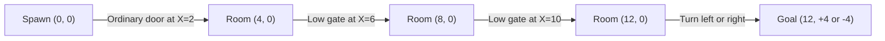
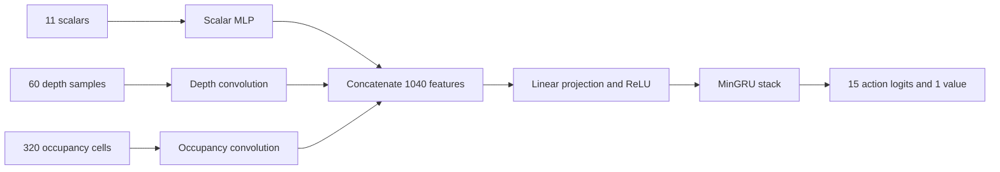

# Shenaniguns3D environment reference and analysis

Shenaniguns3D trains one agent to navigate static 3D obstacle courses and reach
a goal pedestal. Its main skills are steering, jumping, crouching, and choosing
when to change stance. This document describes the local implementation reviewed
on 2026-10-02 at repository revision `ed126c972`, including the checked-in
configuration and fresh verification results. Build, training, viewer, and
dependency instructions are in the [README](README.md).

| Property | Contract |
| --- | --- |
| Environment name | `shenaniguns3d` |
| C environment type | `Env`, also typedef'd as `Shenanigans3D` |
| Agents | One per independent world |
| Simulation | 60 physics ticks per simulated second; one action per tick |
| Units | Meters; Y is up; initial heading is +X |
| Observation | `float32[391]`: 11 scalars, 60 depth samples, 320 occupancy cells |
| Action | Five categorical heads, sizes `[5, 3, 3, 2, 2]`; 180 joint combinations |
| Episode endings | Goal, feet below Y = -9, or time limit; automatic reset |
| CPU simulator | Box3D world and the bundled `PDCharacter` controller |
| GPU simulator | Separate CUDA solver specialized for static axis-aligned boxes |
| Policy | Spatial encoder followed by the standard recurrent MinGRU policy |

## Current configured task

[config/shenaniguns3d.ini](../../config/shenaniguns3d.ini) selects
`course_mode=2`, `course_stage=4`, `course_difficulty=2`, and `max_ticks=1200`.
Stage selection takes precedence over difficulty. This produces five rooms
with a 16 m centerline route, two low gates, and a final left or right turn:



Diagram coordinates are `(X, Z)`. Low-gate clearances vary from 1.18 to 1.28 m.
Door widths and the turn direction are randomized when the course is generated.
The training limit allows 20 seconds of physics, followed by a separate timeout
transition if necessary.

There is no automatic curriculum advancement. `course_stage` selects one
stage for the run; progressing to another stage requires a configuration or
command-line change.

## Source map

| File | Responsibility |
| --- | --- |
| [shenaniguns3d.h](shenaniguns3d.h) | CPU course generation, geometry, sensors, rewards, lifecycle, and rendering |
| [character.h](character.h), [character.c](character.c) | Box3D character shape, acceleration, friction, jumping, stance, stairs, and ground checks |
| [shenaniguns3d.cu](shenaniguns3d.cu) | GPU course generation, collision solver, sensors, rewards, and vector lifecycle |
| [encoder.cu](encoder.cu) | Trainable scalar, depth, and occupancy encoder |
| [shenaniguns3d.c](shenaniguns3d.c) | Standalone human viewer, CPU checkpoint inference, scripted audits, evaluation, and benchmark |
| [tests/test_cpu.c](tests/test_cpu.c) | Paired CPU determinism and finite-output checks |
| [tests/test_gpu.cu](tests/test_gpu.cu), [tests/cpu_reference.c](tests/cpu_reference.c) | CPU/GPU differential checks through the native lifecycle |
| [tests/test_encoder.cu](tests/test_encoder.cu) | FP32 forward and numerical-gradient checks |
| [src/ocean.cu](../../src/ocean.cu) | Registers the custom encoder under `PUFFER_SHENANIGUNS3D` |
| [src/pufferl.cu](../../src/pufferl.cu) | Vector scheduling, recurrent training, log aggregation, and GPU stream binding |

The CPU and GPU implementations duplicate course/controller logic. Changes to
generation, action ordering, rewards, or sensors need corresponding changes in
both implementations and their differential checks.

## Courses and randomization

`create_course_world()` starts with the fixed legacy course, then applies an
enabled curriculum stage. With stages disabled, `course_mode` and
`course_difficulty` choose the legacy or randomized hallway course.

| `course_mode` | Behavior |
| --- | --- |
| `0` | Retain the initial layout. With stages disabled, use the fixed legacy course. |
| `1` | Generate a layout at initialization and reuse it on resets. |
| `2` | Generate at initialization and regenerate on resets after at least one step. |

An enabled stage still invokes its generator in mode 0. Thus mode 0 with a
stage means a retained, seeded stage layout; it does not disable that stage's
initial randomization. Repeated resets at tick zero do not regenerate a course.

With `course_stage=-1`, random modes use difficulty 1 or 2 for variations of
the linear legacy route. Difficulty 2 narrows doors and tends to require longer,
lower crouch tunnels. Difficulty 3 generates the full hallway route. In mode 0,
with stages disabled, difficulty has no effect on the fixed layout.

| `course_stage` | Generated task |
| --- | --- |
| `-1` | Disable stage selection; use mode and difficulty. |
| `0` | Open arena, goal at `(28, 0, 0)`, and up to 12 isolated square columns. One column is deliberately near the direct path. |
| `1` | Three rooms, one turn, 8 m centerline, wide ordinary doors. |
| `2` | Four rooms, two turns, 12 m centerline, wide ordinary doors. |
| `3` | Four rooms, 12 m centerline, a 0.64 m jump lip on a straight connection before the turn. |
| `4` | Five rooms, 16 m centerline, two low gates before a final turn. |
| `5` | Full stress hallway: 11 rooms, 40 m centerline, variable doors and optional low ceiling. Forces difficulty 3 during generation. |

Coordinates in prose and goal tuples use `(X, Y, Z)` unless labeled otherwise.
The stage table describes explicit selectors, not cumulative levels: stage 4
isolates crouching and does not retain stage 3's jump lip. Negative stage values
disable stages; values above 5 currently leave the fixed base course in place
without a validation error.

The fixed legacy route has three door walls at X = 6, 9, and 18.5 m, a shallow
pit centered at X = 10.5 m, a 1.15 m clearance tunnel from X = 12 to 16 m, and
a floor gap from X = 22 to 26 m. The far slab is at Y = -3 m and leads to the
goal at `(30, -3, 0)`. The strip is 4 m wide between its side walls. Its
normalization length is the constant 36 m, although initial horizontal goal
distance is 30 m.

Hallways use rooms with 4 m center spacing and 3.4 m walls. The full generator
advances east and can turn north or south, rejecting revisits and contact
between nonconsecutive rooms. It bounds room Z grid coordinates to `[-2, 2]`
and uses a fallback route if repeated generation attempts fail. It creates a
single route with no deliberate branch choices. Stress door widths are
1.35–1.75 m; low doors have 1.08–1.18 m clearance; jump lips are 0.64 m high.
A low-ceiling room is sampled with probability 0.65 and clearance 1.08–1.22 m.
Jump doors adjoining this ceiling are converted to ordinary doors, then a jump
door is restored elsewhere if needed.

Only low hallway doors get overhead lintels. The `height` metadata on ordinary
and jump hallway doors does not build an overhead obstruction. All course
obstacles are static boxes, including the objects called columns.

### Seeding

Native CPU vector initialization sets each world's RNG to its environment
index; GPU initialization does the same for each lane. The configured
`base.seed=42` does not directly replace these initial course seeds. Course
sequences subsequently depend on RNG consumption and episode resets.

The GPU generator reproduces the glibc `rand_r` sequence used by this Linux
CPU build. That is a platform dependency for CPU/GPU generation parity.
Standalone play/watch uses a runtime seed. Headless evaluation uses course
seed 1000, or 0 with `--trace`, and a separate policy-sampling seed of 1001.
Stochastic watch mode instead consumes the environment RNG for action sampling,
so its later courses also depend on policy sampling.

## Character physics and actions

The CPU character is a dynamic Box3D body with locked rotation, a feet box,
and an upper capsule. Yaw changes the requested movement direction rather than
rotating the collision body. The controller implements acceleration, braking,
air control, stair stepping, and ground snapping. A tick calls stance/jump
handling, `pd_char_pre_step()`, `b3World_Step()`, and `pd_char_post_step()`.

| Quantity | Value |
| --- | --- |
| Standing / crouching height | 1.8288 m / 1.016 m |
| Walking / crouching target speed | 5.842 m/s / 2.54 m/s |
| Jump velocity | 7.62 m/s upward |
| Character gravity setting | 15 m/s² |
| Jump cooldown | 0.2 s |
| Step up / step down setting | 0.4572 m each |
| Standable slope limit | 45 degrees |
| Physics time step / substeps | 1/60 s / 1 |

The controller has a sprint setting, but the environment leaves it off and
exposes no sprint action. Diagonal desired movement is normalized to the stance's
target speed. Velocity observations divide by `MAX_SPEED=5.84`, slightly below
the controller's 5.842 m/s walk setting.

Actions travel as five floats encoding categorical choices:

| Index | Head | Values |
| --- | --- | --- |
| `0` | Turn | `0,1,2,3,4` change yaw by `-12,-6,0,+6,+12` degrees this tick. |
| `1` | Forward | `0` backward, `1` neutral, `2` forward. |
| `2` | Strafe | `0` left, `1` neutral, `2` right. |
| `3` | Jump | `0` off, `1` request a jump. |
| `4` | Crouch | `0` request standing, `1` request crouching. |

The neutral action is `[2, 1, 1, 0, 0]`. Turn/movement inputs are clamped to
their head range and converted to integers; jump and crouch use a `> 0.5`
threshold. Turning precedes translation, so movement uses the updated heading.

A jump succeeds only while grounded with an expired cooldown. Holding jump can
trigger another jump after landing. Crouching preserves the feet position;
standing requires clearance. After a successful stance change, the configured
commitment counter blocks opposite requests for that many subsequent ticks.
The default of 1 therefore blocks an immediate toggle on the next tick.
Standing requests remain pending while the ceiling blocks them.

## Observation layout

`compute_observations()` writes a flat `float32[391]` buffer. The policy treats
its three regions differently. It receives privileged goal distance/bearing
even when the goal is occluded, plus local geometry sampled by rays.

### Scalars at indices 0 through 10

| Index | Meaning | Encoding |
| --- | --- | --- |
| `0` | Forward velocity | Horizontal velocity projected onto heading, divided by 5.84; unclipped. |
| `1` | Rightward velocity | Horizontal velocity projected onto the right vector, divided by 5.84; unclipped. |
| `2` | World heading | `sin(yaw)` |
| `3` | World heading | `cos(yaw)` |
| `4` | Ground contact | `1` grounded, otherwise `0`. |
| `5` | Actual stance | `1` crouched, otherwise `0`. |
| `6` | Ground distance | Downward ray from 0.05 m above the feet, divided by its 5 m range; `1` if no hit. |
| `7` | Goal distance | Three-dimensional feet-to-goal distance divided by route length, capped at `1.5`. |
| `8` | Relative goal direction | `sin(goal bearing - yaw)` |
| `9` | Relative goal direction | `cos(goal bearing - yaw)` |
| `10` | Vertical velocity | `clip(v_y / 15, -1, 1)` |

The scalars do not expose the remaining episode time, jump cooldown, stance
commitment counter, full route, or absolute position. This is a partial view
of simulator state, with recurrent memory available to the policy.

### Depth map at indices 11 through 70

The depth map has shape `[pitch=5, azimuth=12]`, flattened as
`11 + pitch * 12 + azimuth`. Pitches are `[-60, -35, -10, 15, 40]` degrees.
Azimuths are spaced by 30 degrees around the entire agent; azimuth zero follows
its current heading. Rays originate at eye height, 0.2032 m below the top of
the current stance. Distances are divided by the 24 m range, with `1` meaning
no hit within range. Rays ignore the character's own shapes.

The viewer's green horizontal ray overlay is a separate visualization: the
actual five observation pitch rows do not include a zero-degree pitch.

### Occupancy at indices 71 through 390

Occupancy has shape `[height=4, lateral=5, forward=16]`, flattened as:

```text
index = 71 + (height_index * 5 + lateral_index) * 16 + forward_index
```

Its four sample heights above the feet are `[0.25, 0.80, 1.35, 1.90]` m.
Lateral offsets are `[-1.6, -0.8, 0, 0.8, 1.6]` m along the current right
vector. Twenty horizontal forward rays, one per height/lateral pair, each
cover 12 m divided into sixteen 0.75 m bins.

| Cell value | Meaning |
| --- | --- |
| `0` | Unknown space beyond the first hit. |
| `0.5` | Free along the sampled ray before the first-hit bin. |
| `1` | Bin containing the first hit. |

If there is no hit, all sixteen bins on that ray are free. A ray originating
inside an obstacle marks its first bin occupied. This is sparse centerline
sampling: a free value does not certify an entire voxel or a character-sized
passage. Character hull casts determine whether the agent actually fits.

Both maps refresh every tick by default, including after reset. Setting a
sensor interval above 1 reuses the previous array until a divisible tick;
there is no reprojection after motion or turning. That can put an old sensor
frame beside current scalar state. At the default intervals, observation
construction issues 60 depth rays, 20 occupancy rays, and one ground ray per
agent, in addition to the controller's collision queries.

## Episode lifecycle

Reset puts the standing body center at `(0, 1, 0)`, with zero velocity, yaw 0,
no ground contact yet, and cleared cooldown/commitment state. Standing feet
therefore initially lie at Y = 0.0856 m; the controller subsequently settles
onto the floor. Reset also refreshes both sensor maps and initializes the
progress baseline.

Each call to `puf_step()` clears the output reward and terminal flag, then
increments the tick. If the incremented tick exceeds `max_ticks`, it ends the
episode immediately with zero transition reward and no physics step. Thus a
timeout with the current setting logs length **1201**, comprising 1200 physics
ticks and one timeout transition.

Otherwise the environment applies the action, advances physics, calculates
the shaped reward, and checks the goal before checking the kill plane. Success
uses the feet position and strict bounds:

```text
abs(x - goal_x) < 0.65
abs(z - goal_z) < 0.65
goal_y - 1.0 < y < goal_y + 1.5
```

Success does not require ground contact or standing on the pedestal. Falling
ends the episode when feet Y is below -9 m. All three endings set the same
terminal flag; there is no separate truncation flag or terminal observation.
The returned observation is already the next episode's initial observation,
while reward and terminal describe the transition that just ended. Recurrent
callers need to clear episode memory at that boundary.

For a custom CPU integration, zero-initialize `Env`, set `rng`, call
`puf_init()`, bind the agent's observation/action/reward/terminal buffers, and
call `puf_reset()` before stepping. `puf_close()` releases the world and viewer
resources. Direct CPU `puf_reset()` preserves reward/terminal output buffers,
which automatic reset relies on; the next step clears them. Explicit GPU
`puf_reset()` clears those buffers. GPU lifecycle functions operate on the
device vector base rather than an individual host environment.

## Rewards and metrics

For a physics transition, the environment emits:

```text
reward = reward_progress * (previous_distance - current_distance)
         - time_cost
         + jump_penalty   * successful_jump
         + crouch_penalty * successful_crouch_entry
         + reward_head_hit * forward_obstruction
         + reward_goal * reached_goal
         + reward_fall * fell_below_kill_plane
```

For legacy and column courses, progress distance is horizontal Euclidean
distance to the goal. For hallways, it is route length minus progress along
the closest centerline segment, with projection clamped to that segment's
ends. Hallway shaping can reward a necessary turn even when it does not bring
the agent closer to the goal in a straight line. Vertical motion alone does
not change either progress measure.

The undiscounted progress sum telescopes to initial minus final progress
distance, so backtracking reverses earlier progress reward. This shaping uses
a plain distance difference; it is not the discount-adjusted potential formula
that would establish policy invariance for the trainer's `gamma=0.99`.

Jump and crouch penalties apply once per successful jump or crouch entry.
Remaining crouched carries its slower movement speed but no repeated entry
penalty. `reward_head_hit` checks for requested forward movement with post-step
forward speed at most 0.5 m/s and a blocking/overlapping full-stance hull cast
0.75 m ahead. It can detect a lip or wall as well as a ceiling; it is charged
on every qualifying tick. Reverse movement and pure strafing do not trigger it.

| Logged metric | Meaning after trainer aggregation |
| --- | --- |
| `env/perf` | Fraction of completed episodes that reached the goal. |
| `env/episode_return` | Mean sum of emitted rewards per completed episode. |
| `env/episode_length` | Mean step count, including the extra timeout transition. |
| `env/score` | Mean unscaled net progress in meters, not success rate. |
| `env/n` | Number of completed episodes in the reporting interval. |

The environment's `Log` stores sums; `vec_log()` divides them by episode count
and retains the count as `env/n`. Native training also inherits
`train.reward_clip=1.0` from [config/default.ini](../../config/default.ini),
clamping training rewards to `[-1, 1]` before advantage calculation. Environment
episode-return logs retain the original rewards.

## Configuration reference

The fallback column below means an omitted key passed to `puf_init()` or the
GPU config parser. These values differ substantially from the checked-in INI.

| `[env]` key | Code fallback | Checked-in value |
| --- | --- | --- |
| `max_ticks` | `3600` | `1200` |
| `course_mode` | `0` | `2` |
| `course_difficulty` | `1` | `2`, overridden by stage |
| `course_stage` | `-1` | `4` |
| `reward_progress` | `0.05` | `0.01` |
| `time_cost` | `0.0005` | `0.0140794` |
| `reward_goal` | `10` | `1` |
| `reward_fall` | `-10` | `-1` |
| `reward_head_hit` | `-0.005` | `-0.1` |
| `jump_penalty` | Negative configured `time_cost` | `-0.5` |
| `crouch_penalty` | Negative configured `time_cost` | Omitted: resolves to `-0.0140794` |
| `crouch_enter_commit_ticks` | `1` | `1` |
| `crouch_exit_commit_ticks` | `1` | `1` |
| `sensor_depth_interval` | `1` | `1` |
| `sensor_occupancy_interval` | `1` | `1` |

Negative stance commitments clamp to zero. Nonpositive sensor intervals fall
back to 1. The commented `crouch_penalty = -0.000140794` line in the INI is
inactive; it does not describe the effective fallback. The standalone audit
helpers that call `allocate_env()` directly use the hardcoded initialization
defaults rather than loading the training INI.

Training currently uses 4096 agents, four CPU worker threads, one buffer,
`base.async=0`, a 32-wide two-layer policy, horizon 64, minibatch size 8192,
100 million requested timesteps, and learning rate `0.00046088`.
`gamma=0.99`, `gae_lambda=0.99`, and `ent_coef=0.001` are explicit overrides.
Inherited `train.vtrace=0` means the configured V-trace clipping coefficients
are inactive. Inherited `base.reset_every_horizon=0` carries recurrent state
across horizons until an episode ends. `load_model_path=None` starts fresh.

For example, after the CPU-simulation native build in the README:

```sh
# Full stress curriculum
./puffer train --env.course_stage=5

# Randomized legacy difficulty 2, with stage override disabled
./puffer train --env.course_stage=-1 --env.course_difficulty=2
```

Environment settings are read on creation; edit them and restart the process
to apply them. The standalone viewer loads the current INI without native
trainer-style `--env.*` overrides.

## Sensor encoder and policy

The encoder preserves the topology of the two sensor arrays:

| Branch | Operation | Flattened features |
| --- | --- | --- |
| Scalars | Linear `11 -> 32 -> 32`, ReLU after each layer | `32` |
| Depth | Eight `3 x 3` filters; circular azimuth padding, valid pitch, ReLU | `8 x 3 x 12 = 288` |
| Occupancy | Four valid `2 x 2 x 2` filters, ReLU | `4 x 3 x 4 x 15 = 720` |



The projection and recurrent width come from `policy.hidden_size`, which must
be a positive multiple of 8. At the configured width 32 and two recurrent
layers, the serialized model contains 41,528 float slots. Four are reserved
padding in the eight-slot occupancy bias tensor, whose four active entries
correspond to its four filters. This storage layout matters for checkpoint
compatibility. A generic flat-observation MLP has a different layout.

The standalone viewer implements the spatial encoder in C and uses upstream
CPU recurrent inference and action selection. It reads architecture and task
settings from the current config, so those settings must match the checkpoint
and intended evaluation task. `latest` searches the configured checkpoint
directory for a compatible-sized `.bin`, excluding the all-zero initial
checkpoint filename. It chooses by file change time, not policy performance.

## Standalone viewer behavior

The README lists the build and invocation commands. Human play and checkpoint
watch both use `demo()`, which sets `max_ticks=100000` after loading the INI.
Headless `--eval` honors the configured time limit. A long watch session
therefore does not reproduce the training episode horizon.

| Control | Effect |
| --- | --- |
| W / S | Forward / backward |
| A / D | Strafe left / right |
| Left / right arrow | Turn by -12 / +12 degrees per tick |
| Space | Request jump while held |
| Left Ctrl or C | Request crouch while held |
| R | Reset course/character state and policy memory |
| F | Cycle orbit, first-person, and chase cameras |
| Mouse drag / wheel in orbit mode | Orbit / zoom |

`watch` samples actions unless `--deterministic` is supplied. Headless `--eval`
also accepts `--deterministic`; otherwise it reads the evaluation setting from
the base config. `--trace` prints the first twelve transitions of each episode,
including observations, logits, recurrent state, actions, reward, and terminal.
The `--bench` mode runs a ten-second, single-world CPU loop on difficulty 3
with random actions and its own settings.

## Analysis and limitations

### Reward scale and experiment comparisons

The current time cost is about **0.8448 reward per simulated second**. A full
16 m stage-4 route offers only about **0.16 progress reward**, with an additional
**1.0** on success. A jump costs **0.5**, equivalent to about 35.5 ticks of time
cost. An idle timeout accumulates approximately **-16.8953**.

A CPU probe using the current INI and the existing `scripted_course_action()`
helper succeeded for seeds 1000 through 1007. Each took 253 steps and returned
approximately **-2.42173**, with 15.4434 m of net progress. Seed 1000 with neutral
actions timed out on step 1201 with return **-16.89519** and zero final-transition
reward. Successful navigation can therefore have negative return under the
current reward scale. These are scripted checks, not learned-policy results.

The configured sweep varies learning rate, time cost, and progress reward,
while maximizing `episode_return`. Changing reward coefficients changes that
metric even for identical behavior. Sweep return alone therefore cannot rank
navigation quality across those trials. Compare success rate and episode
length under a fixed evaluation reward/task configuration as well. On courses
where falling is available, also check whether avoiding future time penalties
makes an early failure attractive; this review did not establish a learned
failure-seeking policy.

### Generator obstacle guarantees

The full hallway generator tries to include both low and jump gates, but
assigning or restoring a jump gate can overwrite the only low gate. An audit
of CPU generation with `course_difficulty=3` and initial seeds 0 through 9999
found **55 layouts without a low gate**. Of those, **14 also lacked a low
ceiling**, so they contained neither designated crouch obstacle. Seed **947**
is a concrete example: zero low gates, one jump gate, and `ceiling_room=-1`.
All 10,000 sampled layouts retained a jump gate.

The single-seed case can be reproduced in a C translation unit including
`shenaniguns3d.h`, without creating a physics world:

```c
Env env = {.rng = 947, .course_difficulty = 3};
set_fixed_course(&env.course);
randomize_hallway_course(&env);
// Inspect env.course.route_doors[0..9].kind and env.course.ceiling_room.
```

This is a generation coverage defect relative to the code comment promising
both actions in every layout. The GPU generator contains the same assignment
ordering; the counts above were measured on the CPU. A future repair should
preserve the final low-gate invariant when restoring jump gates and verify
it after all obstacle adjustments.

### Physics and throughput limits

The CPU simulator runs the bundled Box3D controller with one physics substep.
The preserved port notes describe four substeps in the original game; sharing
controller code does not establish identical deployment trajectories.

The GPU backend replaces general Box3D dynamics with box sweeps, overlap
correction, and specialized controller logic, one environment per CUDA thread.
It has the same public observation/action contract, but its trajectories drift
from the CPU reference. The checked differential rollout lasts 120 steps and
permits up to 0.75 m position error. The fresh run reached **0.5288019 m**
maximum position error and **1.0** maximum observation-component difference.
Matching static sensors is stronger than matching dynamic rollouts here.

GPU training requires `vec.num_buffers=1`, enforced by the native trainer.
GPU rendering is a no-op; visual playback uses the CPU viewer. FP32 is the
qualified precision; BF16 remains unqualified. On CPU, mode-2 resets destroy
and rebuild worlds inside an OpenMP critical section. Together with the ray
queries, that is a potential throughput cost; no production throughput
benchmark was run for this documentation review.

### Verification performed on 2026-10-02

The installed Box3D checkout was clean at
`c4a414fcfe612a704dcd06ce921348d441271fc7`. GPU checks ran on a GTX 1060 3GB.

| Check | Fresh result and scope |
| --- | --- |
| `make -C ocean/shenaniguns3d test` | Passed 9,216 transitions across paired seeded worlds, all three modes and difficulties; 72 paired completed episodes. |
| `make -C ocean/shenaniguns3d sanitize` | Same CPU suite passed with ASan/UBSan. The separately built Box3D archive is not instrumented. |
| `make -C ocean/shenaniguns3d viewer` | Standalone viewer/evaluator compiled. |
| `viewer --sense-check` | Sensor content checks passed; standing was blocked by a low door and crouching crossed it. |
| `viewer --check` | Scripted fixed-course goal reached at global tick index 385. |
| `viewer --collide` | Both fixed wall/tunnel probes printed `blocked (PASS)`. |
| `viewer --random-check` | 32/32 stress-course variants passed three episodes each, with changed layouts on reset. |
| `make -C ocean/shenaniguns3d gpu-test` | Generation/geometry, timeout, random reset, sensor refresh/overlap, jump-penalty config, goal, and airborne/crouched reset checks passed. Static sensor error at most `2.980232e-8`; rollout drift reported above. |
| `make -C ocean/shenaniguns3d encoder-test` | FP32 encoder and recurrent-policy forward checks, 11 encoder parameter gradient probes, and four decoder/MinGRU gradient probes passed. Encoder forward error `3.933907e-6`; policy output error `9.313226e-9`. |
| Additional current-config probes | Scripted stage-4 and idle episodes described above, plus the 10,000-seed generation audit. These were ad hoc analysis probes, not additions to the committed test suite. |

Viewer commands in this table use `./build/shenaniguns3d/viewer` from the
repository root. `--check` and `--collide` print their outcome but return zero
even when their printed checks fail, so inspect their output. `--random-check`
and `--sense-check` do return failure codes. Policy `--eval` returns 1 whenever
any requested episode fails to reach the goal, even if inference itself ran
correctly.

The CPU determinism suite does not select curriculum stages. GPU tests cover
all stages' generated geometry, but that is not a long-rollout solvability or
learning test for every stage. The randomized viewer audit uses a script with
access to course coordinates. The encoder training-chain checks use explicit
output cotangents through the native forward/backward path, rather than a
complete PPO optimization run.

The [README](README.md) preserves earlier short training/checkpoint and CUDA
graph qualifications. Those training runs were not repeated for this review.
Interactive rendering, BF16, broad CPU/GPU policy-transfer equivalence, and
learned-policy success/generalization remain outside the checks reported here.
